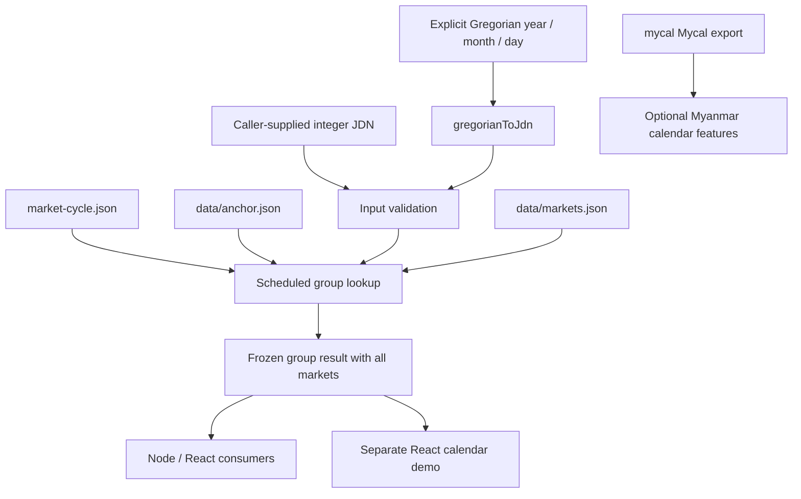

# Shan Market Day: Technical Design

## Project summary

`shan-market-day` is an independent TypeScript library that maps a Gregorian
civil date or integer Julian Day Number (JDN) to a scheduled Shan market group.
It returns all markets in that group with English and Myanmar town/market
labels. A separate React/Vite demo visualizes the calculation.

The package supports Node and React bundlers through ESM and CommonJS exports,
with declarations for both formats. It is a library, not an HTTP service.
The current version is `1.0.0`; market labels are user-approved, but
package publication is a separate action.

## Architecture



`mycal` is not used to calculate the market cycle or Gregorian JDN. Its
`Mycal` class is re-exported for optional Myanmar calendar features.

## Source layout

| Path | Responsibility |
|---|---|
| `src/index.ts` | Public functions/types, data validation, frozen cycle/anchor exports |
| `market-cycle.json` | Ordered five groups and calendar representative IDs |
| `data/anchor.json` | Gregorian reference date, anchor group, JDN, provenance |
| `data/markets.json` | Runtime market records |
| `data/label-review.json` | User approval and current-label snapshots |
| `demo-group.json` | User-corrected authoritative comparison dataset |
| `shan_market_day.json` | Original reference sample, not a runtime input |
| `scripts/check-release.mjs` | Label-approval publication gate |
| `test/market-day.test.mjs` | Calculation, data, module, integration and gate checks |
| `test/types/` | ESM/CommonJS declaration consumer fixtures |
| `tsup.config.ts`, `tsconfig.json` | Library build and strict TypeScript configuration |
| `demo/` | Separate React/Vite calendar application and lockfile |
| `november.jpg`, `december.jpg` | Local-only supporting schedule evidence; excluded from Git/package |

The original sample contains a JSON comment and is retained unchanged.
Production code reads the normalized dataset, not that sample or demo inputs.

## Cycle and anchor

| Index | Original group ID | Runtime slug | Markets |
|---|---|---|---:|
| 0 | `tgi_z` | `taunggyi` | 12 |
| 1 | `tnn_z` | `taungni` | 11 |
| 2 | `snn_z` | `shwenyaung` | 16 |
| 3 | `nns_z` | `nyaungshwe` | 18 |
| 4 | `hh_z` | `heho` | 19 |

The cycle advances once per civil day and wraps from Heho to Taunggyi without
month/year resets. The reference is **2026-10-05 = Heho**, JDN **2461319**.
Heho's index is derived from the cycle by group ID, not duplicated in metadata.

Conceptually:

```text
index = positiveModulo(anchorIndex + inputJdn - anchorJdn, 5)
positiveModulo(x, n) = ((x % n) + n) % n
```

Implementation reduces each JDN modulo five before subtraction. This avoids
loss of integer precision when callers supply safe-integer extremes. Negative
offsets therefore work without a special before-anchor branch.

| Date | JDN | Group |
|---|---:|---|
| 2025-11-29 | 2461009 | Heho |
| 2025-11-30 | 2461010 | Taunggyi |
| 2025-12-01 | 2461011 | Taung Ni |
| 2026-10-05 | 2461319 | Heho |
| 2026-10-06 | 2461320 | Taunggyi |

## Civil-date semantics

`gregorianToJdn(year, month, day)` accepts integer Gregorian date components
for years **1–9999**. It uses the proleptic Gregorian calendar, including dates
before its historical adoption, and validates month lengths and leap years.
Leap years are divisible by four, except centuries not divisible by 400.

The conversion is timezone-independent. It does not parse strings, normalize
invalid dates, or interpret JavaScript `Date` objects. For an instant, callers
must first extract the intended civil date, for example in `Asia/Yangon`.
Do not substitute elapsed timestamp milliseconds or a fractional astronomical
Julian Date for the required date JDN.

`getMarketDay` accepts every safe-integer JDN, including negative values; it
does not impose the Gregorian helper's year range. Extrapolation is a recurrence
calculation, not proof that the schedule operated on that historical date.

## Public API

```typescript
import {
  getMarketDay,
  getMarketName,
  gregorianToJdn,
  marketAnchor,
  marketCycle,
  Mycal,
  type MarketDayResult,
} from 'shan-market-day';

const jdn = gregorianToJdn(2026, 10, 5);
const result: MarketDayResult = getMarketDay(jdn);
const names = result.markets.map(market => getMarketName(market, 'my'));
```

| Export | Contract |
|---|---|
| `gregorianToJdn(year, month, day)` | Validated Gregorian components to integer JDN |
| `getMarketDay(jdn)` | Scheduled group and its complete market list |
| `getMarketName(market, locale)` | Exact `name.en` or `name.my`, no translation fallback |
| `marketCycle` | Frozen ordered group metadata and representative market IDs |
| `marketAnchor` | Frozen anchor metadata |
| `Mycal` | Upstream Myanmar calendar class; separate from market calculations |
| Types | `Locale`, `GroupId`, `Group`, `LocalizedName`, `Market`, `MarketDayResult` |

CommonJS:

```javascript
const { getMarketDay, gregorianToJdn } = require('shan-market-day');
const result = getMarketDay(gregorianToJdn(2026, 10, 5));
```

A result includes:

```typescript
{
  jdn: 2461319,
  groupId: 'hh_z',
  group: 'heho',
  groupOrder: 4,
  cycleDay: 4,
  markets: /* all 19 Heho records */,
  scheduleOnly: true,
  datasetStatus: 'approved'
}
```

Results, market arrays, records and nested localized labels are frozen. Consumers
should copy data if they need editable UI state. Frozen exports protect later
lookups from accidental mutation.

## Dataset contract and approval

Each of the **76** records has:

```typescript
interface Market {
  readonly id: string;
  readonly group: Group;
  readonly groupOrder: number;
  readonly town: { readonly en: string; readonly my: string };
  readonly name: { readonly en: string; readonly my: string };
  readonly cycleDay: number;
}
```

Both numeric order fields equal the zero-based cycle index. They are not dates
of the month or offsets from the Heho reference.

Market IDs are unique and prefixed by the original group ID. Matched records
retain their original suffix; new entries use a group-prefixed descriptive
suffix. Group IDs and readable slugs are different identifiers and must not be
interchanged. Calendar representatives reference market IDs, not group aliases.

The corrected non-null `demo` entries in `demo-group.json` define exact
English/Myanmar market labels and membership. `generate` values are comparison
history, not authoritative. Generated-only rows are excluded. Town labels are
derived by removing the trailing English market suffix and Myanmar `ဈေး`.

Kyauk Ta Lone occurs in Taunggyi and Heho; Pinlon occurs in Taunggyi and
Shwenyaung. Both memberships are retained as supplied with distinct IDs.
The project does not currently resolve whether they are aliases or distinct
locations.

At module initialization, code validates group identities, cycle length and
reset flags, anchor membership/JDN, unique market IDs and prefixes, order fields,
nonempty bilingual labels, and representative membership. Invalid configuration
throws rather than returning an empty or misleading result.

The release gate requires exactly one matching approved review per market and
an `approvedLabels` snapshot equal to its current bilingual town/name fields.
Changing a label invalidates its approval. Approval of labels does not imply
geographic verification or actual-opening confirmation. `datasetStatus` is
currently a literal in the API; release maintainers must keep it consistent with
review decisions rather than assuming it is calculated from review metadata.

## Errors

| Condition | Error |
|---|---|
| Fractional, unsafe, nonnumeric, `NaN` or infinite JDN | `TypeError` |
| Invalid Gregorian components or year outside 1–9999 | `RangeError` |
| Locale other than `en` or `my` | `RangeError` |
| Inconsistent bundled cycle, anchor or market configuration | `Error` at import |
| Missing/mismatched approval snapshots | Release script exits nonzero |

Functions do not silently coerce values. `getMarketName` expects a valid `Market`
record; it is not a general-purpose arbitrary-object validator.

## Calendar dependency decision

`mycal` **2.2.0** is a pinned npm dependency, bundled by tsup into both module
formats. This supports CommonJS consumers without depending on Node's ability
to synchronously load upstream ESM. Its upstream source is not modified.

The former mmcal dependency was removed because its JavaScript was a browser
classic script. mycal has no public JDN converter. During investigation, the
GitHub internal conversion disagreed with the verified anchor; the project
therefore uses its own validated Gregorian converter rather than private
imports or a hidden numeric correction.

Tests smoke-check selected upstream Myanmar calendar behavior, not its entire
calendar implementation. The market schedule's correctness is independent of
upstream Myanmar-year/month calculations.

## Build, consumption and demo

Run from the repository root using Node **20+**:

```powershell
npm ci
npm run typecheck
npm test
npm run check:release
npm pack
```

tsup outputs `dist/index.js`, `dist/index.cjs`, their source maps, and
`index.d.ts`/`index.d.cts`. Package export conditions select the appropriate
runtime/declarations. Published files are limited to `dist`, `README.md` and `TECHNICAL.md`
plus npm's package metadata; input images, review artifacts and the React demo
are not separate distribution files. Runtime market data is bundled into the
generated JavaScript.

Install the release tarball in a consuming project:

```powershell
npm install "C:\path\to\shan-market-day-1.0.0.tgz"
```

The React demo is a separate application with its own dependencies/lockfile:

```powershell
npm run build
Set-Location demo
npm ci
npm run dev
```

It shows a monthly grid, selected-date calculation steps and localized market
lists, initially selecting October 5, 2026. Its `file:..` dependency consumes the
library's package exports. Rebuild the library and restart Vite after library
changes. Build the demo with `npm run build` from `demo`. The library itself
does not depend on React, Vite, DOM globals or an HTTP server.

`npm pack` permits development previews. `npm publish` runs the label gate and
tests via `prepublishOnly`. Neither command replaces human release/version
review. No publication, remote push or commit is implied by a successful build.

## Evidence, checks and limits

The supplied November/December 2025 calendars support all **61** printed
date-to-group assignments and the continuous month boundary. They are two pages
from one calendar with unverified original publication provenance, not
independent historical sources.

The automated suite contains **13 tests**, covering the anchor and group wrap,
all pictured dates, negative offsets and month/year boundaries, safe-integer
extremes, invalid input, complete approved bilingual groups, authoritative demo
membership, immutability, both module formats, Gregorian reference JDNs and leap
rules, mycal smoke integration, and approval snapshots. ESM/CommonJS type
fixtures compile as part of `npm test`. The separate demo build checks its
TypeScript and production bundling; it is not a browser interaction test.

Market results are **scheduled rotation only**. Closures, holidays and
postponements do not reset the base cycle. Live opening status, exception
overrides, further languages and universal historical continuity are not
implemented. Arithmetic support for a date is not evidence of operation then.

## Requirements ownership

| Ticket | Responsibility |
|---|---|
| CAL-2 | Cycle definition and representative mappings |
| CAL-3 | Anchor metadata and civil-date JDN contract |
| CAL-4 | Scheduled-only policy and deferred exceptions |
| CAL-5 | Reviewed bilingual records and ID/membership reconciliation |
| CAL-6 | Lookup API, conversion integration and library packaging |

Later explicit user decisions supersede earlier mmcal-only, draft-label and
original-sample-preservation proposals. Current code and corrected demo data are
the implementation references; MCP contains the decision history.
